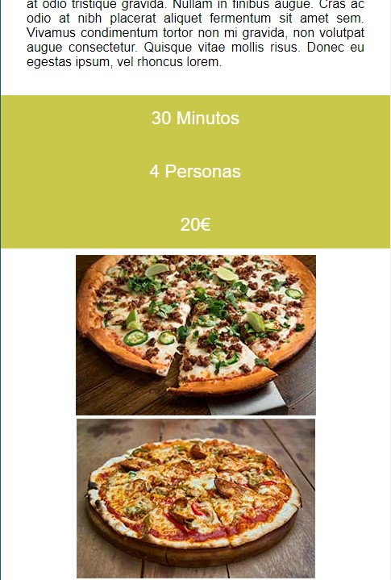
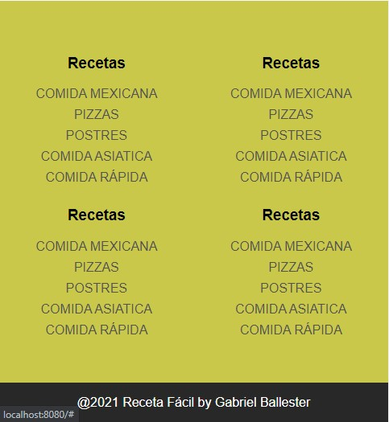

# Blog de recetas 🍕 con Vue y CSS Grid 

## Instalación de dependencias 🔧
```
yarn install
```

## Arranque 🔑
```
yarn serve
```

## Capturas 📷
- ### Vista desktop 💻
.

- ### Vistas mobile 📱 
.
.
.
.
